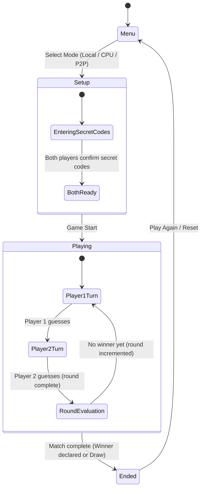

# Data Model: Digit Guess Game

This document defines the state schemas, entities, validation rules, and state transitions for the game.

## Entities & Type Definitions

All types will be declared in TypeScript to enforce compile-time correctness.

### Player
Represents a participant in the game session.

```typescript
export interface Player {
  id: 'player1' | 'player2' | 'cpu';
  name: string;
  secretCode: string | null; // Null until set at configuration phase
  attempts: Attempt[];
  isReady: boolean; // Set to true when secret code is chosen
}
```

### Attempt
Represents a guess made by a player in their turn.

```typescript
export interface Attempt {
  guess: string; // Exactly 4 digits (e.g. "1234")
  hits: number; // Calculated exact matches (0 to 4)
  timestamp: number; // Unix timestamp
}
```

### GameSession
Orchestrates the active match.

```typescript
export type GameMode = 'local' | 'cpu' | 'p2p';
export type GamePhase = 'menu' | 'setup' | 'playing' | 'ended';

export interface GameSession {
  mode: GameMode;
  phase: GamePhase;
  players: {
    player1: Player;
    player2: Player | null; // CPU or second player
  };
  currentRound: number;
  activeTurn: 'player1' | 'player2'; // Indicates whose turn it is to guess
  winner: 'player1' | 'player2' | 'draw' | null;
  p2pConnection: P2PConnectionState | null;
}

export interface P2PConnectionState {
  peerId: string; // Local PeerJS ID
  targetPeerId: string | null; // Connected peer ID
  status: 'idle' | 'connecting' | 'connected' | 'disconnected' | 'error';
  errorMessage: string | null;
}
```

---

## Validation Rules

### 1. Secret Code & Guess Validity
- Must be a string of exactly 4 characters.
- Each character must be a digit from `'0'` to `'9'`.
- Duplicate digits are allowed (e.g., `"1122"`).
- Non-conforming strings must be rejected by UI and store actions.

### 2. Turn Transitions
- A player can only make a guess if `phase === 'playing'` and `activeTurn` matches their player ID.
- Turn transitions:
  - If `activeTurn === 'player1'`, processing a guess moves `activeTurn` to `'player2'`.
  - If `activeTurn === 'player2'`, processing a guess completes the round, increments `currentRound`, and sets `activeTurn` back to `'player1'`.

---

## Game State Machine & Transitions


